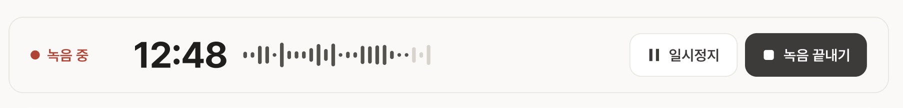
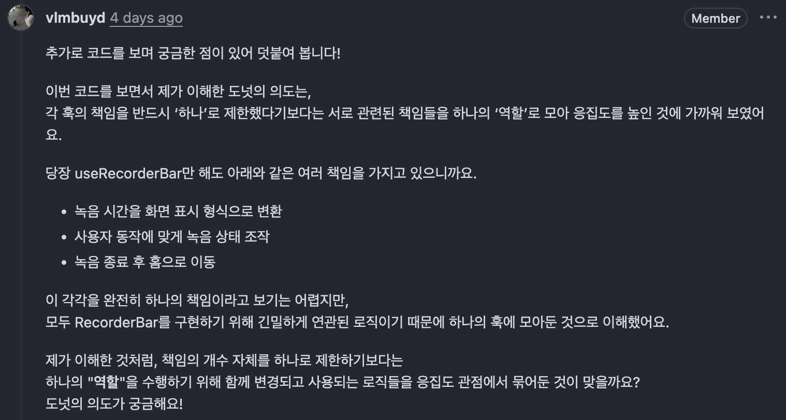
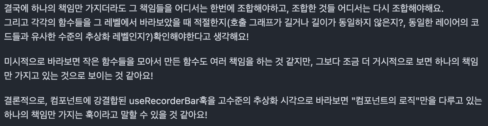
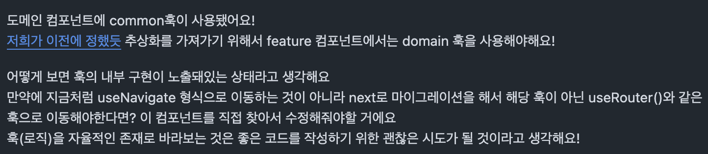
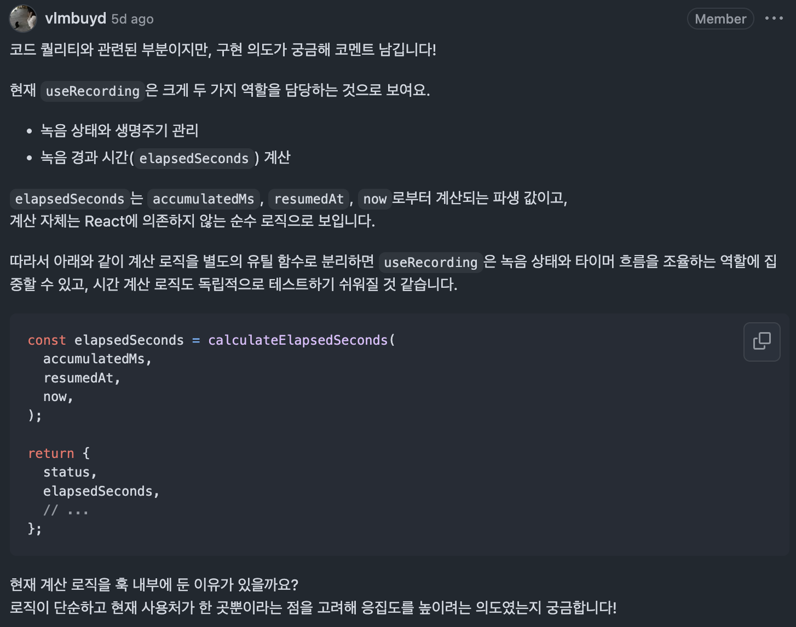

# 일 잘하는 훅은 혼자 다 하지 않는다

『오브젝트』 공부를 시작하고 객체의 자율성과 캡슐화, 책임과 협력에 대해 배우고 있습니다. <br>프로젝트 코드를 작성하고 팀원들과 치열하게 리뷰를 주고받다 보니, <br>책에서 읽은 내용을 자연스럽게 우리가 사용하는 컴포넌트와 훅에 대입해보게 됐어요.

그 과정에서 자주 떠오른 질문이 있습니다.

**좋은 훅이란 무엇일까요?**

하나의 책임만 가져야 한다고 하지만, 실제 훅을 열어보면 <br>상태를 읽는 코드도, 값을 계산하는 코드도, 다른 훅을 부르는 코드도 함께 들어 있습니다.

어디까지 함께 두고 어디서 나눠야 할지, 막상 판단하려면 쉽지 않죠.

이 글은 그 답을 찾아가는 과정의 일부입니다.

『오브젝트』가 말하는 **자율적인 객체**를 훅에 대입해보고, <br>프로젝트 “knot”의 녹음 화면 PR에서 나눈 논의를 따라가며 <br>좋은 훅에 대한 제 생각이 어떻게 달라졌는지 정리해보려 합니다.

<br>

## 객체는 스스로 일한다

『오브젝트』를 읽는 내내 가장 자주 마주친 단어는 **자율성**이었습니다. <br>좋은 객체지향 설계에서는 모든 객체가 스스로 판단하고 행동해야 한다고 하죠.

그렇다면 스스로 일한다는 건 어떤 모습일까요? <br>자기 상태는 자기가 관리하고, 요청을 받으면 어떻게 처리할지도 자기가 정하는 것입니다. <br>그러려면 필요한 정보와 그 정보로 하는 행동이 같은 곳에 있어야 해요.

책의 영화 예매 예제로 비교해보면 차이가 바로 보입니다.

```java
// 바깥에서 요금을 꺼내 대신 계산한다
fee = movie.getFee().minus(discountAmount).times(audienceCount);

// Movie에게 계산을 요청한다
fee = movie.calculateMovieFee(screening);
```

첫 번째 코드에서 `Movie`는 요금을 담아두는 상자에 가깝습니다. <br>할인 규칙이 바뀌면 `Movie`가 아니라, 요금을 꺼내 대신 계산하던 바깥 코드를 고쳐야 하죠.

두 번째 코드에서는 `Movie`가 스스로 계산합니다. <br>요금이 몇 가지든, 어떻게 계산되든 바뀌는 곳은 `Movie` 안뿐이에요.

**변경의 주체가 바깥이 아니라 자기 자신일 때**, 그 객체를 자율적이라고 부를 수 있습니다.

<br>

### 자율성을 지키는 방법, 캡슐화

객체를 자율적으로 만드는 방법은 내부 구현을 **캡슐화**하는 것입니다. <br>바뀔 가능성이 높은 부분은 안에 숨기고, 비교적 안정적인 부분만 밖에 공개하는 거예요.

여기서 오해하기 쉬운 부분이 있습니다. <br>캡슐화는 필드를 `private`으로 막는 것만을 뜻하지 않아요.

`fee`를 `private`으로 막아도 `getFee()`로 그대로 꺼내준다면, <br>요금을 저장하는 방식이 바뀌는 순간 `getFee()`를 쓰던 코드도 함께 바뀌어야 합니다. <br>숨긴 줄 알았는데, 사실은 다 보여주고 있었던 셈이죠.

캡슐화가 지키려는 건 필드가 아니라 **내부가 바뀌어도 바깥은 그대로인 상태**입니다. <br>한마디로, 변경의 영향을 객체 안에 가두는 일이에요.

<br>

### 응집도와 결합도

캡슐화가 잘 되었는지는 두 가지 척도로 확인할 수 있습니다.

- **응집도**: 모듈 안의 코드들이 얼마나 하나의 목적으로 묶여 있는가 <br>→ 저는 이걸 “**같은 이유로 함께 바뀌는가?**”라는 질문으로 이해하고 있어요.
- **결합도**: 다른 모듈에 대해 얼마나 많이 알고 있는가 <br>→ 다른 모듈의 속사정이 바뀌었을 때 나까지 고쳐야 한다면, 결합도가 높은 거예요.

캡슐화를 지키면 모듈 안의 응집도는 높아지고, 모듈 사이의 결합도는 낮아집니다.

정리하면 자율성, 캡슐화, 응집도와 결합도는 모두 같은 곳을 가리키고 있어요. <br>**변경을 한곳에 가두는 것.**

<br>
<br>

## 그렇다면 훅도 자율적일 수 있을까요?

책을 읽다 보면 자꾸 ‘객체’ 자리에 컴포넌트와 훅을 넣어 읽게 됩니다. <br>컴포넌트와 훅도 상태와 로직을 함께 가지고, 서로 값을 주고받으며 협력하니까요.

그중에서도 훅은 일반 함수와 조금 다릅니다.

- **일반 함수**는 불렸을 때만 실행되고, 결과를 받은 컴포넌트가 다음 일을 정합니다.
- **훅**은 React 생애주기 안에서 상태를 기억하고, 이펙트로 스스로 일을 시작할 수도 있어요.

그래서 저는 로직을 훅으로 묶어 둔다는 걸, 그 훅을 **하나의 자율적인 존재로 본다**는 뜻으로 이해했어요. <br>일반 함수로만 묶으면, 다음 일을 정하는 책임의 일부가 여전히 호출하는 컴포넌트에 남으니까요.

물론 반대도 성립합니다. <br>상태도 생애주기도 필요 없는 순수한 계산이라면 굳이 훅으로 감쌀 이유가 없죠. <br>[React 공식 문서](https://ko.react.dev/learn/reusing-logic-with-custom-hooks#should-all-functions-called-during-rendering-start-with-the-use-prefix)도 훅을 쓰지 않는 함수에는 `use`를 붙이지 말라고 안내합니다.

<br>

이렇게 자율적인 객체를 훅으로 옮겨 보니, 자율적인 훅의 모습을 세 가지로 정리할 수 있었어요.

1. **자기 일은 스스로 한다.** <br>컴포넌트가 일일이 지시하지 않아도, 필요한 상태와 생애주기를 알아서 다룬다.
2. **방법은 감춘다.** <br>사용하는 쪽은 반환값만 보고 협력할 수 있다.
3. **모르는 일은 맡긴다.** <br>스스로 할 수 없는 일은 다른 훅이나 함수에 부탁한다.

그런데 이 기준을 들고 실제 코드를 읽어보니, 새로운 고민이 생겼습니다.

<br>

## 녹음 바의 훅을 살펴봅니다



녹음 화면의 `RecorderBar`는 경과 시간을 보여주고, 녹음을 일시 정지하거나 끝낼 수 있는 컴포넌트입니다. <br>필요한 값과 동작은 모두 `useRecorderBar`에서 가져와요.

스타일과 일부 버튼을 생략하면 다음과 같습니다.

```tsx
function RecorderBar() {
  const { elapsedTime, handlePause, handleEnd } = useRecorderBar();

  return (
    <div>
      <span>{elapsedTime}</span>
      <button onClick={handlePause}>일시 정지</button>
      <button onClick={handleEnd}>녹음 끝내기</button>
    </div>
  );
}
```

컴포넌트는 받은 값을 그리기만 합니다.

<br>

그렇다면 `useRecorderBar` 안에서는 무슨 일이 일어날까요? <br>설명에 필요한 부분만 남기면 이렇습니다.

```typescript
export const useRecorderBar = () => {
  // 1. 공통 녹음 기능과 화면 이동 기능을 가져온다
  const { elapsedSeconds, startRecording, pauseRecording, endRecording } =
    useRecording();
  const { navigateToHome } = useNavigateToHome();

  // 2. 화면에 들어오면 녹음을 시작한다
  useEffect(() => {
    startRecording();
  }, [startRecording]);

  // 3. 녹음을 끝내면 홈으로 이동한다
  const handleEnd = () => {
    endRecording();
    navigateToHome();
  };

  // 4. 화면에 보여줄 형태로 반환한다
  return {
    elapsedTime: formatRecordingTime(elapsedSeconds), // 65 → "01:05"
    handlePause: pauseRecording,
    handleEnd,
  };
};
```

주석 순서대로 따라가 보면 흐름이 보입니다.

1. 공통 훅 `useRecording`에서 녹음 상태와 조작 함수를 가져오고
2. 화면에 들어오면 녹음을 시작하고
3. 끝내기 버튼을 누르면 녹음을 멈춘 뒤 홈으로 이동하고
4. `65` 같은 초 단위 숫자를 `"01:05"` 같은 문자열로 바꿔 화면에 건넵니다.

<br>

하나하나 필요한 동작이고, 코드도 자연스럽게 읽혔습니다. <br>그런데 책에서 배운 ‘책임’을 떠올리니 궁금해졌어요.

시간 형식 바꾸기, 버튼 동작 연결하기, 종료 후 이동하기까지. <br>이 훅은 적어도 세 가지 일을 하고 있으니까요.

**이렇게 여러 일을 하는 훅을, 하나의 책임을 가진 훅이라고 볼 수 있을까요?**



그래서 팀원의 코드에 [리뷰 코멘트](https://github.com/woowacourse-teams/2026-Knot/pull/361#discussion_r4091510510)로 이렇게 물었어요. <br>“훅의 책임을 꼭 하나로 제한하기보다, 하나의 역할을 위해 여러 책임을 모아둔 걸로 봐도 될까요?”

<br>
<br>

## 같은 기능에 속하면 응집도가 높은 걸까요?

리뷰에 질문을 남기고 나니, 『오브젝트』를 읽으며 품었던 비슷한 질문이 떠올랐어요. <br>답을 기다리는 동안, 잠깐 책으로 돌아가 볼게요.

책의 영화 예매 시스템에는 두 종류의 할인 조건이 나와요.

- **순번 조건**: 하루 중 몇 번째 상영인지로 판단 (예: 첫 회 상영)
- **기간 조건**: 요일과 시간대로 판단 (예: 월요일 10시\~12시)

책에서 처음 설계한 `DiscountCondition`은 이 두 조건을 한 클래스에서 판단합니다. <br>세부 구현을 조금 덜어내면 다음과 같아요.

```java
public class DiscountCondition {
  private DiscountConditionType type; // 순번 조건인지, 기간 조건인지

  private int sequence;         // 순번 조건에서만 사용
  private DayOfWeek dayOfWeek;  // 기간 조건에서만 사용
  private LocalTime startTime;  // 기간 조건에서만 사용
  private LocalTime endTime;    // 기간 조건에서만 사용

  public boolean isSatisfiedBy(Screening screening) {
    if (type == DiscountConditionType.PERIOD) {
      return isSatisfiedByPeriod(screening);
    }
    return isSatisfiedBySequence(screening);
  }

  private boolean isSatisfiedBySequence(Screening screening) {
    return sequence == screening.getSequence();
  }

  private boolean isSatisfiedByPeriod(Screening screening) {
    // 상영 요일이 같고, 상영 시각이 startTime ~ endTime 사이인지 확인하는 코드 (복잡해서 생략)
    ...
  }
}
```

처음엔 이렇게 생각했어요. <br>“둘 다 ‘할인 조건’이니까, 한 클래스에 잘 모여 있는 것 아닌가?”

하지만 책은 **무엇 때문에 이 코드를 고치게 되는지**를 기준으로 이 클래스를 봅니다.

| 메서드 | 수정하게 되는 이유 |
| --- | --- |
| `isSatisfiedBy()` | 새로운 할인 조건 종류 추가 |
| `isSatisfiedBySequence()` | 순번 할인 규칙 변경 |
| `isSatisfiedByPeriod()` | 기간 할인 규칙 변경 |

순번 조건은 `sequence`만, 기간 조건은 `dayOfWeek`, `startTime`, `endTime`만 사용합니다. <br>순번 규칙이 바뀌어도 기간 조건은 그대로고, 기간 규칙이 바뀌어도 순번 조건은 그대로예요.

‘할인 조건’이라는 이름은 같지만, <br>**서로 따로 바뀌는 규칙과 데이터가 한 클래스에 모여 있는 것**입니다. <br>책이 이 클래스의 응집도가 낮다고 말하는 이유예요.

같은 이름 아래 모여 있다고 응집도가 높은 건 아니었습니다. <br>앞에서 적어둔 질문, “**같은 이유로 함께 바뀌는가?**”로 봐야 했죠.

<br>

### 로딩 화면과 빈 결과 화면은 같은 이유로 바뀔까요?

프론트엔드에서 자주 쓰는 코드에도 같은 질문을 던져봤습니다. <br>문서 검색 결과를 보여주는 컴포넌트예요.

```tsx
function DocumentSearchResult() {
  const { isPending, isError, data } = useSearchDocuments();

  if (isPending) return <p>문서를 찾는 중입니다.</p>;
  if (isError) return <p>문서를 불러오지 못했습니다.</p>;
  if (data.length === 0) return <p>검색 결과가 없습니다.</p>;

  return <DocumentList documents={data} />;
}
```

네 분기 모두 ‘검색 결과 화면’이라는 공통점이 있습니다. <br>그런데 바뀌는 이유를 따라가 보면 이야기가 달라져요.

- 로딩 화면 디자인이 바뀌면 → 이 컴포넌트를 연다
- 에러 안내 문구가 바뀌면 → 또 이 컴포넌트를 연다
- 검색 결과가 없을 때의 안내가 바뀌면 → 또 이 컴포넌트를 연다

서로 관계없는 이유로 같은 코드를 고치게 되니, 이 코드는 응집도가 낮다고 봤어요. <br>`DiscountCondition`이 두 규칙을 한곳에서 직접 구현하던 모습과 닮았습니다.

그런데 마지막 목록 화면은 조금 다릅니다. <br>목록을 어떻게 그릴지는 `DocumentList`에 맡겼기 때문에, 목록 디자인이 바뀌어도 이 컴포넌트는 그대로예요.

<br>

그렇다면 나머지 화면도 각자의 컴포넌트에 맡기면 어떨까요?

```tsx
if (isPending) return <DocumentSearchLoading />;
if (isError) return <DocumentSearchError />;
if (data.length === 0) return <DocumentSearchEmpty />;

return <DocumentList documents={data} />;
```

이제 이 컴포넌트에 남은 일은 **지금 상태에 맞는 화면을 렌더링 하는 것** 하나입니다. <br>여전히 네 가지 경우를 다루지만, 어느 화면의 디자인이 바뀌어도 이 코드는 그대로예요.

여기서 중요한 구분 하나를 얻었습니다.

**여러 일을 다루는 것과, 여러 일을 직접 구현하는 것은 다르다.**

<br>

### 다시 녹음 바의 훅으로

이제 이 구분을 들고 `useRecorderBar`로 돌아가 보죠.

```typescript
export const useRecorderBar = () => {
  ...
  const handleEnd = () => {
    endRecording();
    navigateToHome();
  };

  return {
    elapsedTime: formatRecordingTime(elapsedSeconds),
    ...
  };
};
```

- 시간 표시를 `01:05`에서 `1분 5초`로 바꾸는 요구사항 → `formatRecordingTime`과 관련
- 종료 후 홈이 아닌 다른 화면으로 보내는 요구사항 → `handleEnd`와 관련

둘은 분명 다른 이유로 바뀝니다. <br>그렇다면 `useRecorderBar`도 응집도가 낮은 걸까요?

답하기 전에 먼저 확인해야 할 게 있었습니다.

**이 훅은 각 동작을 어디까지 직접 구현하고 있을까요?**

<br>

## 스스로 하는 일과 맡기는 일

사실 처음 리뷰를 남길 때, 제 머릿속에는 ‘**훅은 하나의 일만 해야 한다**’는 공식이 있었어요. <br>그 공식대로라면 `useRecorderBar`는 일이 너무 많은 훅이고, 쪼개야 할 대상이었죠.

그래도 바로 단정하기보다는 먼저 물어보고 싶었습니다. <br>여러 동작을 굳이 한곳에 둔 데에는 분명 이유가 있을 테니까요.

<br>



[답변](https://github.com/woowacourse-teams/2026-Knot/pull/361#discussion_r4093178642)을 주고받으며 팀원의 의도를 들을 수 있었어요. <br>작은 책임으로 나누더라도 결국 어딘가에서는 다시 조합해야 하고, <br>`useRecorderBar`는 녹음 바가 녹음을 보여주고 조작할 수 있도록 **필요한 동작을 연결하는 자리**라는 것이었죠.

그 이야기를 듣고 나니, 제가 세고 있던 게 조금 달랐다는 생각이 들었어요. <br>일이 몇 개인지 세기 전에, 그 일들을 이 훅이 **직접 하고 있는지**부터 봐야 했던 거죠.

코드를 다시 읽어봤습니다. <br>이번에는 각 줄이 일을 **맡기는지**, 직접 **결정하는지**를 주석으로 표시해봤어요.

```typescript
export const useRecorderBar = () => {
  // 맡김: 녹음 상태와 조작은 useRecording에게
  const { elapsedSeconds, startRecording, pauseRecording, endRecording } =
    useRecording();
  // 맡김: 실제 화면 이동은 useNavigateToHome에게
  const { navigateToHome } = useNavigateToHome();

  // 결정: 이 화면에 들어오면 녹음을 시작한다
  useEffect(() => {
    startRecording();
  }, [startRecording]);

  // 결정: 녹음을 끝내면 홈으로 간다
  const handleEnd = () => {
    endRecording();
    navigateToHome();
  };

  return {
    // 맡김: 시간 형식은 formatRecordingTime에게
    elapsedTime: formatRecordingTime(elapsedSeconds),
    handlePause: pauseRecording,
    handleEnd,
  };
};
```

`맡김`이라고 적은 곳부터 볼게요. <br>`useRecorderBar`는 녹음 상태를 직접 바꾸지 않습니다. <br>`useRecording()`에서 받은 `endRecording()`을 부를 뿐이죠. <br>경과 시간도 직접 계산하지 않습니다. 전달받은 `elapsedSeconds`를 쓸 뿐이에요.

반대로 `결정`이라고 적은 곳이 이 훅이 직접 정하는 부분입니다. <br>화면에 들어오면 녹음을 시작하고, 끝내면 홈으로 간다. <br>결국 이 훅이 정하는 건 **“이 화면에서 녹음이 어떻게 흘러가는가”**, 그 흐름 하나예요.

컴포넌트가 “이제 녹음 시작해”라고 지시하지 않아도, 화면에 들어오면 훅이 알아서 녹음을 시작하죠. <br>앞에서 정리한 첫 번째 모습, **자기 일은 스스로 한다**가 바로 이 부분이에요.

시간 표시도 마찬가지입니다. <br>`formatRecordingTime(elapsedSeconds)`라는 이름만 봐도 무슨 일을 하는지 알 수 있죠. <br>초를 분으로 바꾸고 앞에 `0`을 붙이는 방법까지 이 훅에서 읽을 필요는 없어요.

<br>

이 차이는 코드를 고칠 때 드러납니다.

- **표시 형식이 바뀌면** → `formatRecordingTime` 안만 고치면 된다. `useRecorderBar`는 그대로.
- **종료 후 이동할 화면이 바뀌면** → `handleEnd`를 고친다. 녹음 바의 흐름을 정하는 곳이기 때문에.

<br>

그래서 `useRecorderBar`에 함수 호출이 여러 개 있다는 것만으로 응집도가 낮다고 말하긴 어려웠습니다. <br>동작을 연결할 뿐, 각 동작의 방법은 해당 함수와 훅에 맡기고 있으니까요.

물론 여기에 시간 계산식, 스토어 상태 변경, 라우팅 구현이 하나둘 들어오기 시작하면 이야기가 달라집니다. <br>그때부터는 각 구현이 바뀔 때마다 이 훅도 함께 고쳐야 하겠죠.

<br>

결국 봐야 할 건 두 가지였어요.

1. **이 훅을 고치게 만드는 이유는 무엇이고, 서로 다른 이유가 얼마나 있는가?** → 응집도
2. **함께 쓰는 각 동작의 방법이 잘 감춰져 있는가?** → 캡슐화

**몇 개의 일을 하느냐보다, 그 일을 직접 하느냐 맡기느냐**가 더 중요한 질문이었습니다.

<br>
<br>

### 정보를 가장 잘 아는 곳에 맡기기

그렇다면 무엇을, 누구에게 맡겨야 할까요? <br>『오브젝트』 5장은 그 첫 번째 원칙으로 **정보 전문가(INFORMATION EXPERT) 패턴**을 소개합니다.

**책임은 그 일에 필요한 정보를 가장 잘 아는 객체에 맡긴다.** <br>그리고 스스로 할 수 없는 일은 메시지를 보내 다른 객체에 부탁한다. <br>그 메시지는 다시 받는 쪽의 책임이 되고요.

녹음 코드를 이 기준으로 정리하면 다음과 같습니다.

| 책임 | 필요한 정보 | 맡은 곳 |
| --- | --- | --- |
| 경과 시간 계산 | 누적 시간, 재개 시각, 현재 시각 | `calculateElapsedSeconds` |
| 녹음 시작·정지·종료 | 전역 녹음 상태 | `useRecording` |
| 녹음 바의 표시 형식과 종료 후 흐름 | 녹음 바 화면이 어떻게 동작해야 하는지 | `useRecorderBar` |
| 실제 화면 이동 방법 | 라우터 구현 | `useNavigateToHome` |

`useRecorderBar`는 녹음 상태도, 라우터도 직접 알지 못합니다. <br>대신 **녹음 바에서 무엇이 어떤 순서로 일어나야 하는지**는 누구보다 잘 알죠.

그래서 그 흐름만 직접 책임지고, <br>나머지는 `endRecording()`, `navigateToHome()`이라는 메시지로 아는 쪽에 맡깁니다. <br>앞에서 정리한 자율적인 훅의 세 번째 모습, **모르는 일은 맡긴다**가 바로 이거예요.

<br>

### 방법은 감추기

맡길 때는 **방법(세부 구현)을 드러내지 않는 것**도 중요합니다.

<br>

다른 PR에서 팀원이 남긴 리뷰가 이 부분을 잘 보여줘요. <br>닉네임을 입력받아 등록하는 `NicknameCard` 컴포넌트였습니다.

```typescript
export default function NicknameCard() {
  const [nickname, setNickname] = useState("");
  const navigate = useNavigate(); // 컴포넌트가 라우터를 직접 알고 있다

  // ...닉네임 등록이 끝나면
  navigate("/onboarding/complete");
}
```



[리뷰](https://github.com/woowacourse-teams/2026-Knot/pull/211#discussion_r3882261177)에서 팀원이 짚은 건 `useNavigate` 부분이었어요. <br>이 한 줄 때문에 컴포넌트는 ‘어디로 가는지’뿐 아니라 ‘**어떤 라우터로 가는지**’까지 알게 됩니다. <br>나중에 라우팅 방식이 바뀌면, 이동하는 컴포넌트를 하나하나 찾아 고쳐야 하죠.

<br>

```typescript
export const useRecorderBar = () => {
  const { navigateToHome } = useNavigateToHome();
  ...
};
```

`useRecorderBar`가 이동을 `useNavigateToHome`에 맡긴 것도 같은 이유입니다. <br>녹음 바는 **‘홈으로 간다’만 말하고**, 어떻게 가는지는 몰라도 돼요. <br>라우터가 바뀌어도 고칠 곳은 `useNavigateToHome` 하나뿐이에요.

앞에서 정리한 두 번째 모습, **방법은 감춘다**가 바로 이것이고, <br>이렇게 방법을 감출수록 훅과 컴포넌트 사이의 결합도도 낮아집니다.

<br>
<br>

## 시간 계산은 왜 훅이 아닌 함수일까요?

이번에는 한 단계 안쪽으로 들어가 볼게요. <br>`useRecorderBar`가 녹음 상태를 맡겼던 공통 훅, `useRecording`입니다. <br>녹음 바가 받아 쓰던 `elapsedSeconds`도 바로 여기서 만들어져요.

리뷰 당시의 `useRecording`을 흐름만 남겨 줄이면 다음과 같습니다. <br>(상태를 꺼내는 부분과 타이머 부분은 설명을 위해 한 줄로 묶었어요.)

```typescript
const useRecording = () => {
  // 1. 전역 스토어에서 녹음 상태를 꺼낸다
  const { status, accumulatedMs, resumedAt, ...actions } = useRecordingStore();

  // 2. 녹음 중에는 1초마다 현재 시각을 갱신한다
  const now = useNow({ enabled: status !== "idle" });

  // 3. 경과 시간을 훅 안에서 직접 계산한다
  const elapsedMs =
    accumulatedMs + (resumedAt === null ? 0 : Math.max(0, now - resumedAt));
  const elapsedSeconds = Math.floor(elapsedMs / 1000);

  return { status, elapsedSeconds, ...actions };
};
```

녹음 상태를 꺼내고, 현재 시각을 갱신하고, 경과 시간까지 직접 계산하고 있죠. <br>저는 이 중 **3번, 경과 시간 계산**만 별도 함수로 떼어내자고 제안했어요.



여러 동작을 함께 둬도 괜찮다고 해놓고, 이번엔 왜 떼어냈을까요?

먼저 계산에 쓰이는 값 세 가지를 볼게요.

- `accumulatedMs`: 이전 녹음 구간에서 누적한 시간
- `resumedAt`: 현재 녹음 구간을 시작한 시각. 일시 정지 상태라면 `null`
- `now`: 현재 시각

예를 들어 3초 녹음하고 멈췄다가, 다시 시작해 2.5초가 지났다면 총 녹음 시간은 5.5초입니다. <br>화면에는 초 단위로 보여주니 소수점을 버린 `5`가 되죠.

<br>

여기서 눈여겨볼 점은 **이 계산에 React 상태도 이펙트도 필요 없다**는 것입니다. <br>값만 넣으면 답이 나와요. 리뷰 이후 실제로 추가된 함수는 다음과 같습니다. <br>(상수와 주석은 간소화했어요.)

```typescript
function calculateElapsedSeconds(
  accumulatedMs: number,
  resumedAt: number | null,
  now: number,
) {
  const runningMs =
    resumedAt === null ? 0 : Math.max(0, now - resumedAt);

  return Math.floor((accumulatedMs + runningMs) / 1000);
}
```

`runningMs`는 다시 시작한 뒤 흐른 시간입니다. <br>일시 정지 중이면 `0`, 아니면 현재 시각에서 재개 시각을 뺀 값이에요. <br>여기에 이전에 쌓인 시간을 더해 초 단위로 바꿉니다.

<br>

`useRecording`은 이제 값을 준비해서 건네기만 하면 됩니다.

```typescript
const elapsedSeconds = calculateElapsedSeconds(
  accumulatedMs,
  resumedAt,
  now,
);
```

덕분에 테스트도 가벼워졌어요. <br>컴포넌트를 렌더링하거나 타이머를 돌릴 필요 없이, 값만 넣어 확인하면 됩니다.

```typescript
// 누적한 3초 + 재개 후 2.5초 → 소수점을 버린 5초
expect(calculateElapsedSeconds(3000, 10_000, 12_500)).toBe(5);
```

일시 정지 상태, 1초 미만의 시간, 현재 시각이 재개 시각보다 이른 경우를 확인하는 테스트도 함께 추가됐습니다. <br>[계산 분리 논의](https://github.com/woowacourse-teams/2026-Knot/pull/361#discussion_r4091458920)가 [실제 변경](https://github.com/woowacourse-teams/2026-Knot/commit/bfd98d78bc22c574e4796df6715c8950bb1df53d)으로 이어진 부분이에요.

<br>

앞에서 정리한 자율적인 훅의 기준으로 돌아가 보면, 이 분리는 자연스러운 선택이었습니다.

- 경과 시간 계산은 무언가를 기억하거나 스스로 시작할 필요가 없다 → **함수**
- `useRecording`은 녹음 상태를 들고 시간을 갱신하고, `useRecorderBar`는 화면에 들어오면 녹음을 시작한다 → **훅**

**스스로 일해야 하는 것은 훅으로, 값만 받아 답을 내면 되는 것은 함수로.** <br>그 결과 계산 규칙은 따로 검증할 수 있게 됐고, `useRecording`은 함수 이름만으로 계산의 의도를 드러내게 됐어요.

물론 모든 계산을 함수로 빼야 한다는 뜻은 아니에요. <br>분리했을 때 더 읽기 쉽고, 더 검증하기 쉬워지는지를 보고 판단하면 충분하다고 생각해요.

<br>

## 다시, 좋은 훅이란

처음 질문은 ‘좋은 훅이란 무엇일까?’였습니다. <br>그 답을 찾다가 ‘여러 일을 하는 훅도 괜찮을까?’라는 고민을 만났죠.

돌아보면 이 글에서 확인한 건 세 가지였어요.

- 응집도는 **책임의 개수가 아니라 변경의 이유**로 봐야 한다.
- 여러 일을 **다루는 것**과 여러 일을 **직접 구현하는 것**은 다르다.
- 일은 그 일을 **가장 잘 아는 곳**에 맡기고, 스스로 일할 필요가 없는 계산은 훅이 아닌 함수로 둔다.

그래서 지금의 제 답은 ‘**여러 일을 해도 괜찮다, 그 훅이 자율적이라면**’에 가깝습니다. <br>자율적인 훅은 자기 일은 스스로 하고, 그 방법은 감추고, 모르는 일은 아는 쪽에 맡길 줄 아는 훅이에요. <br>그렇게 일하는 훅이라면 여러 일을 조합하더라도 변경은 각자의 자리에 머뭅니다.

솔직히 ‘훅은 하나의 일만’이라는 공식은 여전히 편한 기준이에요. 코드를 빠르게 판단하게 해주니까요. <br>다만 이제는 그 공식을 결론이 아니라 질문의 출발점으로 쓰려고 합니다. <br>“일이 많네?”에서 멈추지 않고, “그 일들을 누가 하고 있지?”까지 한 번 더 들어가 보는 거죠.

책을 읽을 때는 빈 화면에서 책임과 협력을 찾아낼 수 있을지 막막했는데, <br>동작하는 코드를 읽고 팀원에게 의도를 묻다 보니 조금씩 보이기 시작했습니다. <br>어쩌면 책임도 처음부터 정답처럼 나누는 게 아니라, 리뷰를 주고받으며 제자리를 찾아가는 것인지도 모르겠네요.

그래서 다음 리뷰부터는 “몇 가지 일을 하나요?”보다 “**이 일은 누가 가장 잘 알까요?**”를 먼저 보려고 합니다.
